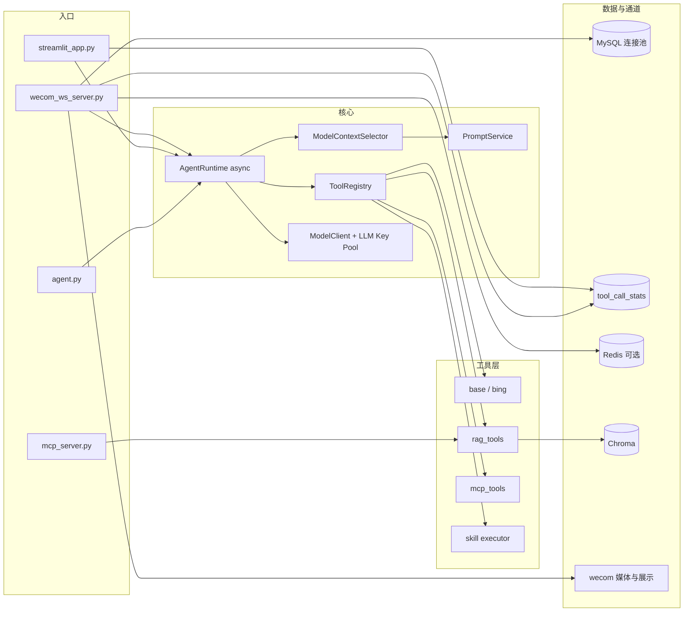

# WeChat_Agent

基于 **ReAct** 的智能助手，支持本地 CLI、**Streamlit Web 对话**与企业微信 **WebSocket 长连接**三种入口。

仓库地址：[github.com/Arnioss/WeChat_Agent](https://github.com/Arnioss/WeChat_Agent)

核心能力包括：

- 工具调用（内置工具 + MCP 远端工具）
- 本地知识库 **RAG**（多模态入库；向量 + BM25 混合召回、RRF 融合、cross-encoder rerank）
- **Skill** 动态检索与上下文注入（`allowed_tools` 约束、`load_skill_instructions` 按需加载完整指令）
- **上下文选择器**（`TOOL_SELECTOR_MODEL` 小模型为每轮筛选 skill / tool 短名单；不足时可 `expand_tool_context` 扩展）
- 必应中文搜索与网页抓取（无需 API Key）
- 会话持久化（MySQL）、消息去重、流式状态（可选 Redis）
- 进程内指标 `AppMetrics` + MySQL `tool_call_stats` 工具调用统计（无内置 HTTP `/metrics` 暴露）
- 可选 **MCP 服务导出**（`mcp_server.py`，将本地工具以 Streamable HTTP 对外提供）

---

## 入口一览

| 入口 | 文件 | 说明 |
| --- | --- | --- |
| 本地 CLI | `agent.py` | 命令行多轮对话，`/exit` 退出，`/clear` 清空上下文 |
| Streamlit Web | `streamlit_app.py` | 浏览器多会话对话；用 `run_streamlit.bat` 或 `streamlit run` 启动 |
| 企业微信长连接 | `wecom_ws_server.py` | WebSocket 主动推送流式回复；用 `run_wecom.bat` 启动 |
| MCP 服务（可选） | `mcp_server.py` | FastMCP 导出本地工具，`--transport streamable-http` 默认 `0.0.0.0:8000` |

---

## 主要能力

- **本地对话**：CLI 流式展示「执行过程」与「思考结果」，知识库回答中的图示路径可点击打开。
- **网页对话**：与 CLI 共用 `ReActAgent` 内核；侧栏多会话管理（新建 / 搜索 / 切换 / 删除）；匿名用户 Cookie 持久化；欢迎页快捷提问；支持知识库正文内嵌图片展示。
- **企业微信长连接**：`enter_chat` 欢迎语、`text` 触发 Agent；流式内容经 WebSocket **主动推送**（非 HTTP 回调轮询）；支持知识库图片经企微媒体上传展示；启动前可选 MCP / Agent 预热。
- **上下文选择**：每轮用户消息先经 `ModelContextSelector`（`TOOL_SELECTOR_MODEL`）筛选候选 skill 与 tool，减轻主模型 prompt；候选不足时主 Agent 可调用 `expand_tool_context` 二次扩展。
- **知识库问答**：`rag_summarize` 检索 `knowledge/` 并总结；多模态管线对 PDF/DOCX 内图做 caption 后入库；检索链路为 **Chroma 向量 + BM25 关键词 → RRF 融合 → rerank 精排**；流程类问题可展开连续分片（`RAG_FLOW_*`）。
- **联网补充**：`bing_search`（必应中文）、`crawl_webpage`（抓取正文，部分站点黑名单）。
- **MCP 扩展**：Streamable HTTP MCP 工具映射为 `mcp_<server>_<tool>`；本地亦可用 `mcp_server.py` 对外暴露 RAG 等工具。
- **Skill 系统**：`skills/<name>/SKILL.md` 自动发现、检索匹配、注入提示词；支持 `/skill <name> <问题>` 强制激活；`allowed_tools` 限制激活 skill 后可见工具集。
- **稳定性**：异步 `AgentRuntime`、按 `msgid` 去重、会话恢复、超时保护、按 `bot_id` 隔离、同会话 asyncio 锁防并发。

---

## 架构概览



---

## 项目结构

```text
.
├─ agent.py                 # CLI 入口
├─ streamlit_app.py         # Streamlit Web 入口（多会话 UI）
├─ wecom_ws_server.py       # 企业微信长连接入口
├─ mcp_server.py            # 可选：FastMCP 导出本地工具
├─ build_rag_index.py       # 构建 / 增量更新 RAG 索引
├─ check_env.py             # MCP / Chroma / RAG 环境检查
├─ check_env.bat            # pip check + check_env.py
├─ install_deps.bat
├─ build_rag_index.bat
├─ run_streamlit.bat
├─ run_wecom.bat
├─ .env.example             # 环境变量模板（复制为 .env 后使用）
├─ requirements.txt
├─ pyproject.toml
├─ config/
│  └─ mcp_servers.json.example
├─ skills/
│  ├─ knowledge-rag-answer/
│  └─ testcase-generator/
├─ tools/
│  ├─ base_tools.py              # get_current_date
│  ├─ bing_cn_tools.py           # bing_search, crawl_webpage
│  ├─ rag_tools.py               # rag_summarize, rag_rebuild_index
│  └─ mcp_tools.py
├─ rag/
│  ├─ vector_store.py       # Chroma 向量检索（唯一向量后端）
│  ├─ keyword_retrieval.py  # BM25 关键词召回
│  ├─ rerank.py             # cross-encoder rerank 客户端
│  ├─ http_key_pool.py      # RAG 嵌入 / rerank / vision 429 换 key
│  ├─ rag_service.py
│  ├─ env_config.py
│  └─ ingestion/            # 解析、caption、分片流水线
├─ app/
│  ├─ agent/               # ReAct 运行时、上下文选择器、提示词、Key 池
│  ├─ mcp/
│  ├─ skills/
│  ├─ application/conversation/
│  ├─ channel/wecom/
│  ├─ contracts/
│  └─ infrastructure/      # 日志、缓存、AppMetrics、tool_call_recorder
├─ db/
│  ├─ client.py             # MySQL 连接池（会话持久化）
│  └─ tool_call_stats.py    # 工具调用次数 / 耗时聚合表
├─ knowledge/               # RAG 原始文档目录
├─ wecom/                   # 企微图片投递、媒体上传
└─ wxwork/                  # 企微加解密（遗留模块）
```

**Git 仓库未包含（本地自行准备）：** `Python3.12/`（便携 Python）、`.env`、`config/mcp_servers.json`、`.rag_store/`、`.mcp_cache/`。

---

## 安装依赖

```powershell
git clone https://github.com/Arnioss/WeChat_Agent.git
cd WeChat_Agent
copy .env.example .env
copy config\mcp_servers.json.example config\mcp_servers.json
```

按需修改 `.env` 与 `config/mcp_servers.json` 中的密钥与账号。

若目录内已有 `Python3.12/`，优先使用下文 **Windows 便携包** 方式，无需在目标机器单独安装 Python。

开发者使用系统 Python 或虚拟环境时：

```bash
python -m pip install -U -r requirements.txt
```

要求 **Python ≥ 3.10**（见 `pyproject.toml`）。

---

## Windows 便携包运行

Git 仓库不含 `Python3.12/`（体积约 700MB）。分发 zip 包或本地开发时请自行准备：

- `Python3.12/`（可选，推荐 Windows 便携包）
- `.env`（由 `.env.example` 复制，勿提交真实密钥）
- `config/mcp_servers.json`（由 `config/mcp_servers.json.example` 复制）
- `requirements.txt`
- `config/`、`knowledge/`
- 各 `.bat` 脚本

解压后在项目根目录执行：

```powershell
.\check_env.bat
```

看到 `[环境检查] 通过` 即可继续。

| 脚本 | 用途 |
| --- | --- |
| `check_env.bat` | `pip check` + `check_env.py`（MCP / Chroma / RAG 多模态） |
| `install_deps.bat` | 用 `Python3.12\python.exe` 安装 / 补齐依赖 |
| `build_rag_index.bat` | 构建本地 RAG 索引 |
| `run_streamlit.bat` | 启动 Streamlit（`0.0.0.0:8501`，启动前自动清理占用 8501 的旧进程） |
| `run_wecom.bat` | 启动企业微信长连接机器人 |

脚本统一使用 `Python3.12\python.exe`，勿改为系统 `python`，以免 MCP / Chroma 版本不一致。

---

## 环境变量

在项目根目录维护 `.env`。完整模板见 **`.env.example`**，克隆后执行：

```powershell
copy .env.example .env
```

按需覆盖 `WECHAT_BOT_ID`、`WECHAT_BOT_SECRET`、`OPENROUTER_API_KEYS` 等个人/环境相关项。下文仅保留常用说明，**以 `.env.example` 为准**。

### 模型与 ReAct

见 `.env.example` 中「模型」「ReAct / CLI」分组。

**多 Key 与分池**：通用列表 `OPENROUTER_API_KEYS=key1,key2`；企微/Web 分池使用 `OPENROUTER_API_KEYS_WECHAT` 与 `OPENROUTER_API_KEYS_WEB`，池内 round-robin，本分池全 429 时可借用对方池（`LLM_KEY_CHANNEL_FALLBACK=1`）。全局并发由 `LLM_MAX_INFLIGHT` 限制（两入口共享 Semaphore）。RAG 嵌入 / rerank / vision 请求共用 `rag/http_key_pool.py`，遇 429 自动换 key。

**上下文选择器**（可选但推荐）：

```env
TOOL_SELECTOR_MODEL=qwen3-coder-flash
TOOL_SELECTOR_TIMEOUT_SECONDS=8
```

未配置 `TOOL_SELECTOR_MODEL` 时，主 Agent 暴露全部工具（fallback 模式）。

### 并发与多实例

单进程 Streamlit 无法承载大量并发。建议：

- 企微 `wecom_ws_server.py` 与 Web `streamlit_app.py` 各部署 **2+ 进程**，前接负载均衡；Redis / MySQL 共享。
- `LLM_MAX_INFLIGHT` 按 Key 数量调参；`MYSQL_POOL_SIZE` 每进程 20–30。
- 开启 `REDIS_ENABLED=true` 后，Web 与企微的会话 lease、流状态可跨实例生效。

### MySQL（会话持久化，Web 场景必填）

见 `.env.example` 中「MySQL」分组。连接池由 `db/client.py` 管理（`MYSQL_POOL_SIZE` 等）。Web 入口在 `MYSQL_ENABLED=false` 时会拒绝启动。

| 表 / 模块 | 用途 |
| --- | --- |
| `tool_call_stats` | 工具调用次数 / 成功失败 / 耗时聚合（首次调用时自动建表） |

### 会话、去重与企微

见 `.env.example` 中「企业微信长连接」「会话、去重、流状态」分组。企微 / Web 启动前可通过 `WECHAT_*_WARMUP_*` / `WEB_*_WARMUP_*` 预热 MCP 与 Agent，减少首条消息延迟。

### Redis（可选）

见 `.env.example` 中「Redis」分组。`REDIS_ENABLED=false` 时仍须设置 `REDIS_KEY_PREFIX`。

### RAG（多模态知识库）

见 `.env.example` 中「RAG」分组。核心开关：

| 变量 | 说明 |
| --- | --- |
| `RAG_KEYWORD_ENABLED` | BM25 关键词召回（型号、命令、错误码等） |
| `RAG_RRF_K` | 向量 + BM25 的 RRF 融合常数 |
| `RAG_RERANK_ENABLED` | cross-encoder rerank 精排 |
| `RAG_RETRIEVE_CANDIDATES` | 送入 rerank 的候选条数 |
| `RAG_RERANK_MIN_SCORE` | rerank 最低相关分阈值 |

向量后端仅 **Chroma**（`RAG_CHROMA_API_IMPL`，Windows 建议 `SegmentAPI`）。

### 必应搜索（可选调参）

```env
BING_CN_SEARCH_TIMEOUT_SECONDS=15
BING_CN_CRAWL_TIMEOUT_SECONDS=30
BING_CN_CRAWL_MAX_CHARS=12000
```

### Skill

```env
SKILL_ENABLE_SCRIPTS=false
SKILL_SCRIPT_TIMEOUT_SECONDS=20
SKILL_SCRIPT_OUTPUT_LIMIT=4000
SKILL_SHORTLIST_LIMIT=3
```

### Streamlit Web（可选）

```env
WEB_BOT_ID=web
WEB_USER_COOKIE_DAYS=365
WEB_KB_IMAGE_MAX_WIDTH=800
WEB_CODE_WRAP_COLUMN=120
WEB_MCP_WARMUP_ENABLED=1
WEB_AGENT_WARMUP_ENABLED=1
```

### 日志

```env
LOG_LEVEL=INFO
LOG_CONSOLE_ENABLED=true
LOG_FILE_ENABLED=true
```

企微日志前缀为 `wechat_server.*`，Web 为 `streamlit.*`，写入 `logs/` 目录。

---

## 启动方式

### 1) 本地 CLI

```powershell
.\Python3.12\python.exe agent.py
```

CLI 可通过 `LLM_KEY_CHANNEL=default|wechat|web` 指定 Key 分池（见 `.env.example` 注释）。

### 2) Streamlit 网页对话

```powershell
.\run_streamlit.bat
```

浏览器访问 `http://localhost:8501`（局域网可用脚本提示的 LAN 地址）。**不要**直接 `python streamlit_app.py`（缺少 Streamlit 运行时）。内核与 CLI 相同，均读取 `.env`。

### 3) 企业微信长连接

```powershell
.\run_wecom.bat
```

### 4) MCP 服务导出（可选）

```powershell
.\Python3.12\python.exe mcp_server.py --transport streamable-http
```

默认监听 `0.0.0.0:8000`；亦支持 `--transport stdio`。

建议首次启用 RAG 前先建索引：

```powershell
.\check_env.bat
.\build_rag_index.bat
```

**推荐联调顺序：**

1. `git clone` 并 `copy .env.example .env`、`copy config\mcp_servers.json.example config\mcp_servers.json`
2. 按需修改 `.env` 与 MCP 配置
3. `.\check_env.bat`（无 `Python3.12/` 时先 `pip install -r requirements.txt` 或 `.\install_deps.bat`）
4. （可选）`.\build_rag_index.bat`
5. 本地验证：`agent.py` 或 `run_streamlit.bat`
6. 企微：`run_wecom.bat`

---

## 内置工具

`agent.build_tools()` 默认注册以下工具（`RAG_ENABLED=false` 时不含 `rag_summarize`）：

### 通用

| 工具 | 说明 |
| --- | --- |
| `get_current_date` | 当前日期 |
| `bing_search` | 必应中文搜索（HTML 解析，无 API Key） |
| `crawl_webpage` | 抓取网页正文（部分域名黑名单） |

### 知识库 / MCP / Skill / 运行时

| 工具 | 说明 |
| --- | --- |
| `rag_summarize` | 知识库检索问答（需 `RAG_ENABLED`） |
| `mcp_*` | MCP 远端工具（见配置） |
| `load_skill_instructions` | 读取指定 skill 的完整 `SKILL.md` |
| `list_skill_resources` / `load_skill_reference` | Skill 资源列举与引用加载 |
| `run_skill_script` | 执行 skill 脚本（需 `SKILL_ENABLE_SCRIPTS=true`） |
| `expand_tool_context` | 运行时扩展本轮可用工具集（由 `AgentRuntime` 注入） |

工具展示统一使用 `ToolRichMetadata`（`app/agent/tool_metadata.py`），`ToolRegistry` 按 `priority` 排序；多参数工具通过**关键字参数**映射调用；`PromptService` 注入「工具路由」短提示，与 ReAct 标签协议兼容。

---

## 上下文选择器

每轮用户消息进入 `AgentRuntime` 前，`ModelContextSelector` 调用 `TOOL_SELECTOR_MODEL` 输出 JSON 短名单：

- **candidate_skills**：本轮相关 skill（含置信度与理由）
- **candidate_tools**：本轮相关工具（始终保留 `get_current_date`、skill 元工具等基础项）

主 Agent 仅在短名单内看到 OpenAI function schema，显著降低 prompt 体积。若模型判断工具不足，可调用 `expand_tool_context(need=...)` 触发二次选择或 fallback 全量工具。

企微 / Web 入口在结构化日志中记录 `selector` 阶段耗时（`log_timing` → `AppMetrics`）。

---

## Skill 系统

- 启动时扫描 `skills/*/SKILL.md`（YAML front matter + Markdown 正文）。
- 每轮按关键词 / 标签 / 优先级检索，将摘要注入系统提示词；激活 skill 后受 `allowed_tools` 约束可见工具集。
- 强制激活：`/skill <skill-name> <问题>`
- 需要完整流程时优先 `load_skill_instructions(skill_name)`，分场景细节用 `load_skill_reference`。
- `run_skill_script` 需 `SKILL_ENABLE_SCRIPTS=true`。

内置示例：

| Skill | 用途 |
| --- | --- |
| `knowledge-rag-answer` | 知识库 / 流程 / 规范类问答 |
| `testcase-generator` | 测试用例生成辅助 |

---

## MCP Streamable HTTP

配置文件：`config/mcp_servers.json`（由 `config/mcp_servers.json.example` 复制后填写），或通过环境变量 `MCP_SERVERS_JSON` / `MCP_CONFIG_PATH` 覆盖。

支持标准 `{"mcpServers": {...}}` 与项目数组格式；**仅支持带 `url` 的 Streamable HTTP**，`command` / `args`（stdio）会跳过。

工具命名：`mcp_<server_name>_<tool_name>`。单参数工具可传位置参数或单个 JSON 对象；多参数内置工具与 MCP 工具按 JSON 字段映射为**关键字参数**调用。

`config/mcp_servers.json.example` 内置示例服务：

| 服务 | 说明 |
| --- | --- |
| `qyapi-mcp` | 企微文档 MCP（需替换 apikey） |

启动时发现远端工具并缓存到 `.mcp_cache/tool_cache.json`；远端不可达时若有缓存仍可展示工具名，调用时返回明确错误。

验证：

```powershell
.\check_env.bat
# 或
python check_env.py
python check_env.py --mcp-only
python check_env.py --chroma-only
python check_env.py --rag-only
```

---

## RAG 知识库

- **数据目录**：`RAG_DATA_DIR`（默认 `knowledge/`）
- **持久化**：`RAG_PERSIST_DIR`（默认 `.rag_store/`）
- **建索引**：`build_rag_index.py` 或 `build_rag_index.bat`（支持逐文件保存进度）
- **向量后端**：Chroma（`SegmentAPI`，可通过 `RAG_CHROMA_API_IMPL` 配置）
- **多模态**：`rag/ingestion/` 解析 PDF/DOCX/图片，可选视觉模型生成 figure caption 后分片入库
- **混合检索**：Chroma 向量召回 + BM25 关键词召回 → RRF 融合 → 可选 `RAG_RERANK_MODEL` cross-encoder 精排
- **问答**：Agent 侧 `rag_summarize`；`RAG_ENABLED=true` 时提示词要求知识类问题优先走知识库

**故障排查：**

- 控制台 `[RAG] …` 进度；`RAG_TRACE_LOG=true` 时输出 rerank trace；长时间无输出可增大 `RAG_HTTP_TIMEOUT_SECONDS` 或检查嵌入网关网络。
- Windows `0xC0000005` / Chroma 失败：确认使用 `Python3.12\python.exe`，执行 `install_deps.bat`，关闭占用 `.rag_store` 的进程后重建索引。
- Linux 系统 SQLite 过旧：需 `pysqlite3-binary`（见 `requirements.txt`）。

---

## 运行机制摘要

- **异步运行时**：`AgentRuntime.arun` 为企微 / Web 主路径；同会话 `asyncio.Lock` 防止并行处理。
- **知识优先**：`RAG_ENABLED=true` 时，事实类问题优先 `rag_summarize`；回答区分知识库要点与模型补充（见 `PromptService`）。
- **会话隔离**：`bot_id + user_id + session_id`；MySQL / Redis / 去重均按机器人隔离。
- **企微流式**：先推送 `stream_id` 与占位文案，后台线程跑 Agent，同一条 WebSocket 持续推送至 `finish=true`；知识库图片经 `wecom/image_delivery` 上传展示。
- **工具统计**：企微 / Web 通过 `tool_call_observer` 写入 MySQL `tool_call_stats`；进程内 `AppMetrics` 记录 LLM / 阶段耗时；需 Prometheus 时可自行旁路导出。

企业微信仅保留 **WebSocket 长连接** 主链路（已移除 v0.1.0 的 HTTP 回调入口 `wechat_robot_server.py`）。

---

## 从 v0.1.0 升级（Breaking Changes）

若你使用过 [v0.1.0](https://github.com/Arnioss/WeChat_Agent/releases/tag/v0.1.0)，请注意：

| 项目 | v0.1.0 | 当前版本 |
| --- | --- | --- |
| 企微入口 | `wechat_robot_server.py`（Flask HTTP 回调） | `wecom_ws_server.py`（WebSocket 长连接） |
| 企微凭据 | `WECHAT_ROBOT_TOKEN` + `WECHAT_ROBOT_ENCODING_AES_KEY` | `WECHAT_BOT_ID` + `WECHAT_BOT_SECRET` |
| 流式回复 | 客户端轮询 `stream` | WebSocket 主动推送 |
| Web UI | 无 | `streamlit_app.py` / `run_streamlit.bat` |
| 健康检查 | `GET /healthz`、`GET /metrics` | 进程内 `AppMetrics`（无 HTTP 暴露） |
| MCP 配置 | `config/mcp_servers.json` | 由 `config/mcp_servers.json.example` 复制后填写 |

升级步骤：拉取最新代码 → 重新 `copy .env.example .env` 并按注释填写 → `copy config\mcp_servers.json.example config\mcp_servers.json` → `build_rag_index.bat`（若启用 RAG）→ 用 `run_wecom.bat` 或 `run_streamlit.bat` 启动。

---

## 开发与检查

```bash
# 环境 / MCP / RAG 检查
python check_env.py
python check_env.py --chroma-only --test-rust
```

---

## 代码注释规范

Python 使用中文 docstring：`功能：`、`参数：`、`返回值：`（必要时 `异常：`）；无参写 `- 无。`；包 `__init__.py` 一行模块说明即可。描述须与实现一致。

---

## 开源与合规

- 许可证：MIT（见 `LICENSE`）
- 中文许可证参考译文：见 `LICENSE.zh-CN.md`（仅供阅读，法律效力以英文原文为准）
- 安全漏洞反馈：见 `SECURITY.md`
- 贡献说明：见 `CONTRIBUTING.md`
- 社区行为准则：见 `CODE_OF_CONDUCT.md`
- 第三方实现说明：见 `THIRD_PARTY_NOTICES.md`
